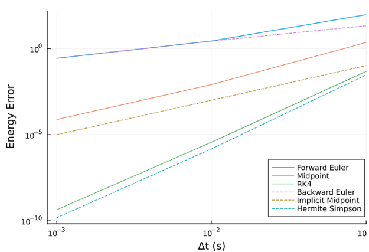
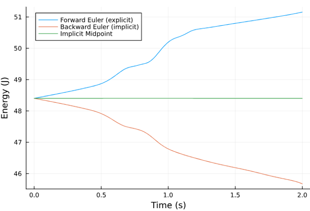
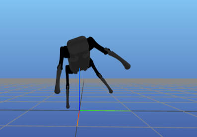
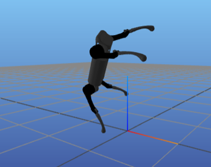
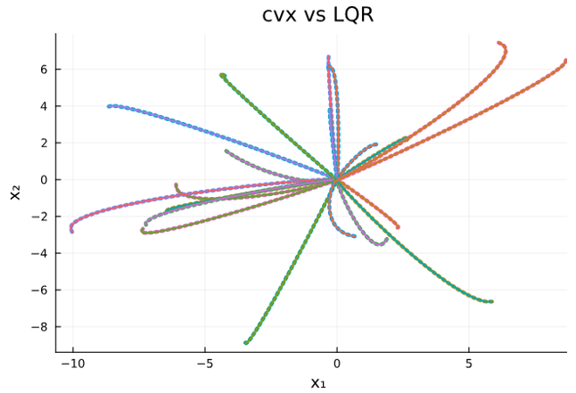
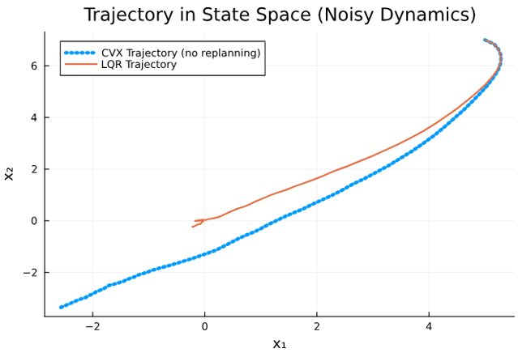
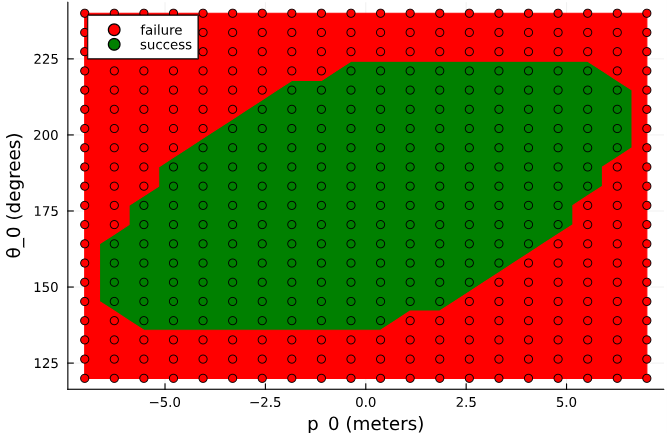

Assignments for 16-745 - Optimal Control, taught by Zachary Manchester at Carnegie Melon University in Winter 2024, https://optimalcontrol.ri.cmu.edu/

## HW0
[HW0 + Julia Video Walkthrough](https://www.youtube.com/watch?v=RetAn_9AOMg)
Basics of Julia

## HW1
[HW1 Walkthrough Video](https://www.youtube.com/watch?v=V7i0tQlBLlE)
1. Implement 3 explicit and 3 implicit integrators to simulate a double pendulum and examine the differences in accuracy. The goal of this problem is to start thinking about integrators as modular, and demonstrate the difference between explicit and implicit integrators.

    

2. Write a well structured implementation of Newton's method with a backtracking linesearch. Use this function to solve a simple constrained optimization problem, then use it to solve for the motor torques and configuration for a quadruped to balance on one leg.
   
    

3. Implement a Quadratic Program (QP) solver using the Augmented Lagrangian method. This solver will then be used in a clever way to simulate a falling brick as it makes contact with the floor.
<video src="https://github.com/user-attachments/assets/e6053154-8702-41d1-9893-b025c5951408" controls="controls" style="width: 50%;"></video>

## HW2
1. Solve for the finite-horizon LQR controls as a convex optimization problem, then solve for the optimal feedback policy with the Ricatti recursion. Show that these are equivalent.

    

2. Use TVLQR to track a cartpole swingup, as well as infinite horizon LQR to stabilize the cartpole in the inverted position.
<video src="https://github.com/user-attachments/assets/fff6eb30-6d2b-4953-ad5f-d1431e0aaa0c" controls="controls" style="width: 50%;"></video>

<video src="https://github.com/user-attachments/assets/7fc53f8a-0e39-4e93-8ef4-a401f6c89599" controls="controls" style="width: 50%;"></video>
<video src="https://github.com/user-attachments/assets/a03211ff-75ce-441c-988d-d352217d2955" controls="controls" style="width: 50%;"></video>

3. Design controllers using LQR, convex trajectory optimization, and convex MPC for controlling the SpaceX Dragon spacecraft as it rendezvous with the ISS.

   

## HW3
1. Solve for a cartpole swingup trajectory using NonLinear Programming (NLP) with IPOPT via direct collocation.

2. Solve for an aggressive quadrotor aerobatic manuever using iLQR.
<video src="https://github.com/user-attachments/assets/5c61cfbf-c630-442f-8eaa-484cc34b488b" controls="controls" style="width: 50%;"></video>

3. Use any tool(s) to generate collision free trajectories for three planar quadrotors.
<video src="https://github.com/user-attachments/assets/a69385ec-ab2a-4b55-a38e-7b32d6bae4d2" controls="controls" style="width: 50%;"></video>

## HW4
[HW4 Walkthrough Video](https://youtu.be/RFmqw3YTRnc)
1. Iterative Learning Control (ILC) for a car as it avoids an obstacle.
<video src="https://github.com/user-attachments/assets/ebf279cc-fb5c-4a13-ac8c-4d517f1260bf" controls="controls" style="width: 50%;"></video>

2. Making a robot walk with hybrid trajectory optimization with a pre-determined contact sequence.
<video src="https://github.com/user-attachments/assets/e7f43e86-f9b0-47f5-a9b1-187b31deb08b" controls="controls" style="width: 50%;"></video>
